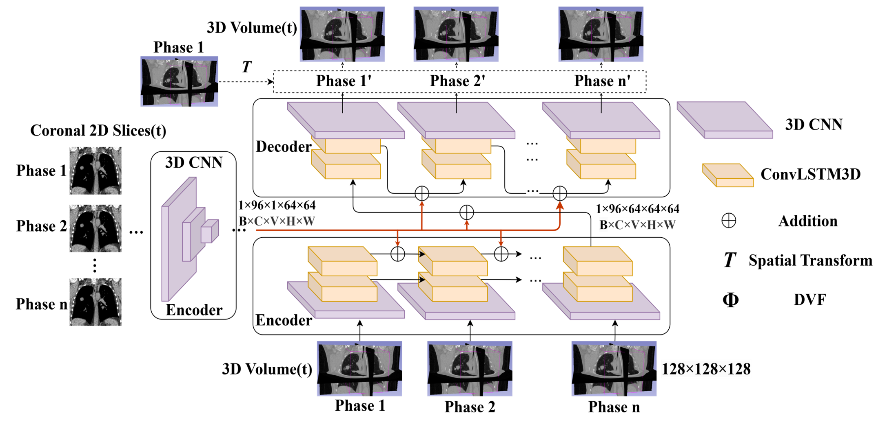

<!-- PROJECT LOGO -->
<br />
<p align="center">
    <h1 align="center"><strong>Dimensional Expansion Method for Time-Series Lung Imaging</strong></h1>
    <p align="center">
<!--     <a href="https://doi.org/10.1088/1361-6560/acb484">Read Link</a> |
    <a href="https://arxiv.org/pdf/2301.11422.pdf">Preprint</a> |
    <a href="https://youtu.be/xIx8B_Q_R9o">Supplementary Video</a> |
    <a href="#usage">Usage</a> |
    <a href="https://github.com/nadeemlab/SeqX2Y/issues">Report Bugs/Errors</a> -->
  </p>
</p>

<!--  A pytorch implementation of the paper [RMSim: Controlled Respiratory Motion Simulation on Static Patient Scans](https://doi.org/10.1088/1361-6560/acb484) by Donghoon Lee, Ellen Yorke, Masoud Zarepisheh, Saad Nadeem, and Yuchi Hu.
In this repository, we provide the code for the proposed RMSim model and the pretrained model. 
We implemented the train logic from the original paper, and the test logic for the LUNA and 4DCT Dicom dataset.

In training logic, we reimplement the loss function with MSE loss and cross entropy loss, and we use the 4DCT dataset to train the model, and in testing, we use the LUNA dataset to test the model. -->

## Abstract
To address the issue in radiotherapy where respiratory motion can lead to misalignment of the radiation target, increasing the exposure dose to healthy tissues, an MR-linac device capable of real-time MR imaging has been developed. However, this device is limited to the measurement of a couple of two-dimensional images in real-time and cannot fully capture three-dimensional information of the lungs. This study proposes a method for dimensional expansion from two-dimensional images to three-dimensional images using deep learning, aimed at providing real-time respiratory motion information as three-dimensional time-series images during treatment, considering the application to support radiation therapy planning. The proposed model, consisting of a three-dimensional convolutional neural network and long short-term memory, is trained to learn lung features using 4D-CT data and two-dimensional time-series images in the coronal plane as inputs. By inputting real-time two-dimensional time-series images captured during treatment into the model, the system expands them into three-dimensional time-series images of the lungs. Cross-validation was performed on six patients, and experimental results using a 4D-CT dataset showed that the structural similarity index between the dimensional expansion images and ground-truth images was 0.96 $\pm$ 0.03 on average, an improvement of 0.05 over conventional methods, suggesting that the proposed model can accurately expand two-dimensional time-series images into three-dimensional time-series images.

*Architecture of the proposed deep learning model. The backbone adopts a Seq2Seq encoder-decoder framework, incorporating 3D convolution layers for encoding and decoding features, alongside 3D convolutional Long Short-Term Memory (ConvLSTM3D) layers to capture spatial-temporal correlations across time points. The 3D image volume dimensions are 128 × 128 × 128, with input features to ConvLSTM3D sized at 64 × 64 × 64 × 96 (Depth × Width × Height × Channels).*

## Usage

1. git clone the project to your local machine.

``` bash
git clone https://github.com/ChenKaiXuSan/DEMT-LI.git
```

2. make the run time environment, here we recommend you to use the docker to run the code, you can find the dockerfile in the docker folder.

3. change the directory to the project folder.

``` bash
cd  DEMT-LI/
```

4. run the code.

``` bash  
python project/main.py
```

have a cup of coffee and wait for the result.

<!--  `
A pretrained model as well as a set of 20 breathing traces and LUNA public CT dataset can be downloaded [here](https://zenodo.org/record/7730879). Once the data is downloaded, unpack the **pretrained_model.zip** into the **trained_model** folder and unpack **LUNA_imaging.zip** and **LUNA_mask.zip** into the **public_data** folder. Finally, test code can be run using the **test_LUNA.py** script to generate 10 phases, DVF, and the deformed masks. The resuts will be generated in the results folder. The final results from the test run can also be found [here](https://zenodo.org/record/7730879). 
` -->


## Folder Tree 
``` bash
.
|-- configs
|   `-- data
|   `-- optimizer
|-- docker
|-- images
|-- logs
|-- project
|   `-- dataloader
|   `-- models
|   `-- utils
|-- test
|   `-- bak
`-- dataset(use your own dataset)


```

## Dataset 

For datset, we use the popi open source dataset, you can download from [here](https://continuousregistration.grand-challenge.org/data/).

This dataset include different patient's 4d CT medical image, in .dcm format.
For one patient, it includ 10 different breatch type in one cycling, and one cycling include 140 dicom images.
<!-- 
## logs

2023-08-11
- optimize the code 
  - mkdir ./test to store the test results and file.
  - try sitk to load the medical from .dicm and .nrrd.
  - config the hydra, you can use ./configs/config.yaml to confige your parmeters.
  - add pip commedn to ./requirements.txt
  - complete loss function (smoothl1loss+MSEloss) -->

<!-- ## Reference
If you find this work useful in your research or if you use parts of this code, please cite the original paper:
```
@article{lee2023rmsim,
  title={RMSim: controlled respiratory motion simulation on static patient scans},
  author={Lee, Donghoon and Yorke, Ellen and Zarepisheh, Masoud and Nadeem, Saad and Hu, Yuchi},
  journal={Physics in Medicine and Biology},
  volume={68},
  issue={4},
  pages={045009}
}
```  -->
