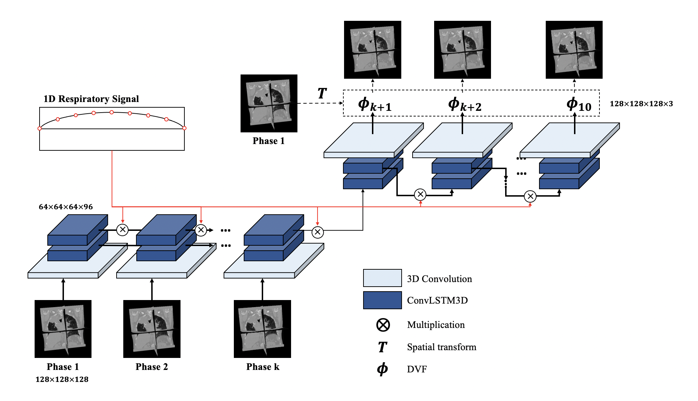

<!-- PROJECT LOGO -->
<br />
<p align="center">
    <h1 align="center"><strong>RMSim: Controlled Respiratory Motion Simulation on Static Patient Scans</strong></h1>
    <p align="center">
    <a href="https://doi.org/10.1088/1361-6560/acb484">Read Link</a> |
    <a href="https://arxiv.org/pdf/2301.11422.pdf">Preprint</a> |
    <a href="https://youtu.be/xIx8B_Q_R9o">Supplementary Video</a> |
    <a href="#usage">Usage</a> |
    <a href="https://github.com/nadeemlab/SeqX2Y/issues">Report Bugs/Errors</a>
  </p>
</p>

A novel 3D Seq2Seq deep learning respiratory motion simulator (RMSim) that learns from 4D-CT images and predicts future breathing phases given
a static CT image. The predicted respiratory patterns, represented by time-varying displacement vector fields (DVFs) at different breathing phases, are modulated through
auxiliary inputs of 1D breathing traces so that a larger amplitude in the trace results in more significant predicted deformation. Stacked 3D-ConvLSTMs are used to capture
the spatial-temporal respiration patterns. A spatial transformer deforms the static CT with the predicted DVF to generate the predicted phase image. 10-phase 4D-CTs were used to train RMSim. 

*The schematic image for the proposed deep learning model. The Seq2Seq encoder-decoder framework was used as the backbone of the proposed model.  The model was built with 3D convolution layers {for feature encoding and output decoding} and 3D convolutional Long Short-Term Memory (3D ConvLSTM) layers (for spatial-temporal correlation between time points). The last layer of the decoder was a spatial transform layer to warp the initial phase image with the predicted Deformation Vector Field (DVF). To modulate the respiratory motions the 1D breathing trace was given as input along with the initial phase image. The dimension of image volume was 128 x 128 x 128 and the input feature to 3D ConvLSTM is 64 x 64 x 64 x 96 (Depth x Width x Height x Channel)}.*

## Usage
A pretrained model as well as a set of 20 breathing traces and LUNA public CT dataset can be downloaded [here](https://zenodo.org/record/7730879). Once the data is downloaded, unpack the **pretrained_model.zip** into the **trained_model** folder and unpack **LUNA_imaging.zip** and **LUNA_mask.zip** into the **public_data** folder. Finally, test code can be run using the **test_LUNA.py** script to generate 10 phases, DVF, and the deformed masks. The resuts will be generated in the results folder. The final results from the test run can also be found [here](https://zenodo.org/record/7730879). 

## Issues
Please report all issues on the public forum.


## License
© SeqX2Y code is distributed under **Apache 2.0 with Commons Clause** license, and is available for non-commercial academic purposes. 


## Reference
If you find our work useful in your research or if you use parts of this code, please cite our paper:
```
@article{lee2023rmsim,
  title={RMSim: controlled respiratory motion simulation on static patient scans},
  author={Lee, Donghoon and Yorke, Ellen and Zarepisheh, Masoud and Nadeem, Saad and Hu, Yuchi},
  journal={Physics in Medicine and Biology},
  volume={68},
  issue={4},
  pages={045009}
}
```
